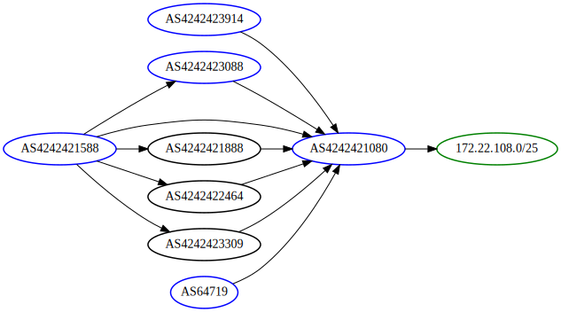

# routegraphs

Generate BGP reachability graphs from MRT dumps.

Live demo (dn42 tables): [IANA](https://routegraphs.highdef.network) | [dn42](http://routegraphs.highdef.dn42)



## Installation

On modern Python installations you'll probably want to create a [venv](https://docs.python.org/3/library/venv.html) first:

Then, enter it and install dependencies with `pip install -r requirements.txt`

## Usage

### Backend

The backend script `mrt2sql.py` reads routes, adjacencies, etc. from MRT dumps and converts it into a SQLite database for querying. This process takes a a few minutes and can probably be optimized further: currently ~2min to read IPv4 + IPv6 dn42 tables.

```
usage: mrt2sql.py [-h] db_filename mrt_filenames [mrt_filenames ...]

positional arguments:
  db_filename    SQLite DB to write to
  mrt_filenames  MRT dump filenames

options:
  -h, --help     show this help message and exit
```

The `do-update.sh` script wraps around this to pull MRT dumps from the [dn42 Route Collector](https://dn42.dev/services/Route-Collector) and write the resulting DB into the `data/` folder. (I run this in a cron job on my deployment)

### CLI client

The `routegraphs.py` CLI client reads the DB and a query to generate a [Graphviz](https://graphviz.org/) .dot file.

```
usage: routegraphs.py [-h] db_filename out_filename target source_asn [source_asn ...]

positional arguments:
  db_filename   SQLite DB to read FROM
  out_filename  file to export .dot graph to
  target        target prefix to graph
  source_asn    source ASNs to graph FROM

options:
  -h, --help    show this help message and exit
```

### Flask Web UI

The Flask web frontend provides interactive queries for routegraph. The frontend loads its configuration via environment variables:

- `ROUTEGRAPHS_DB` **(required)**: path to SQLite database
- `ROUTEGRAPHS_BASE_URL`: base URL to the site, for creating links inside graphs

#### Development server

```
ROUTEGRAPHS_DB=path/to/your/db flask run
```

#### Production server

I use nginx and gunicorn for my set up, but there are [many ways to deploy Flask apps](https://flask.palletsprojects.com/en/2.3.x/deploying/). Some systemd examples for starting routegraphs with gunicorn live in the [`systemd/`](systemd/) folder.
